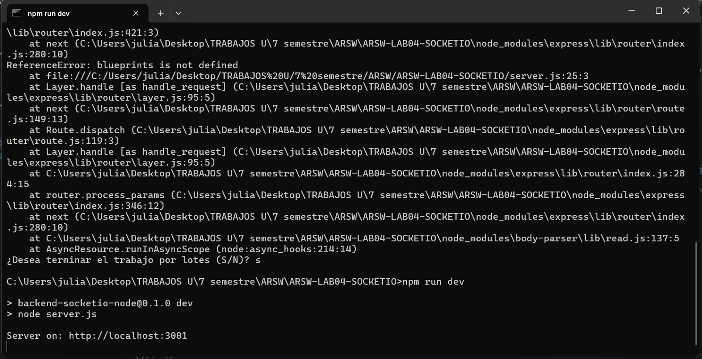
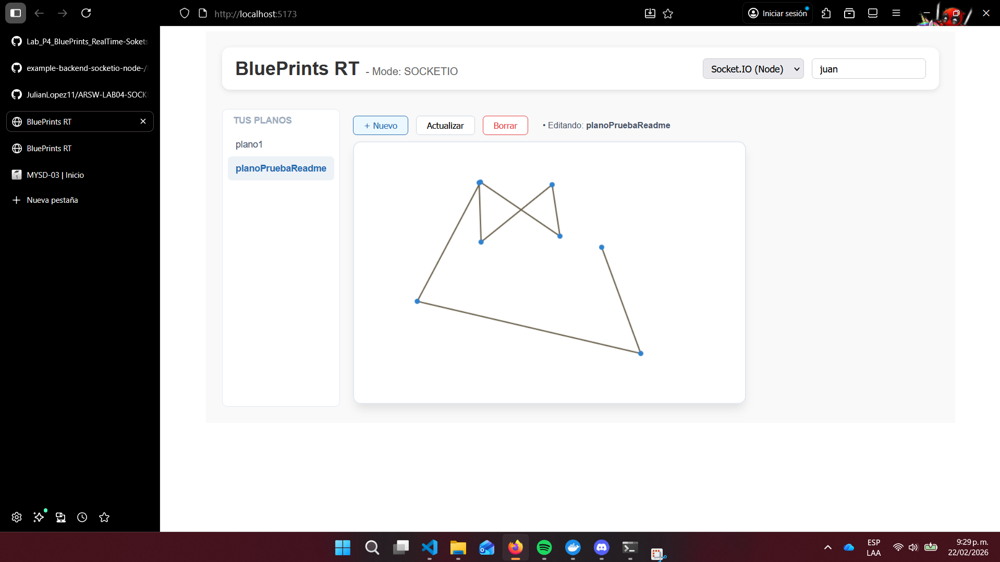
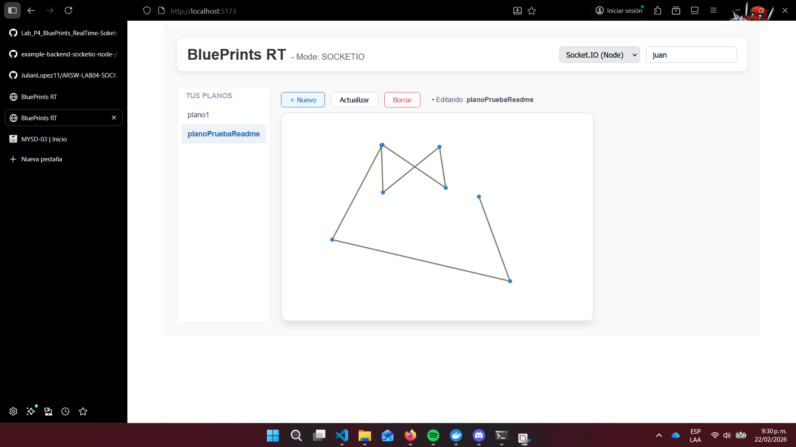

# example-backend-socketio-node — Backend Socket.IO para BluePrints P4

**Objetivo:** entender, explicar y poner en funcionamiento un **backend Node.js + Socket.IO** que habilite colaboración en tiempo real (dibujo de planos) e integre con el **front React (Blueprints – Parte 4)**.

---

## 🧩 ¿Qué resuelve este backend?
- API REST mínima para entregar **estado inicial** de un plano.
- **Tiempo real** con **Socket.IO**:
  - Unirse a salas por **autor/plano**.
  - Enviar puntos de dibujo y hacer **broadcast** a los demás clientes.
- Integración directa con el **frontend React P4** (Canvas + CRUD + selector RT).

---

## 🏗️ Arquitectura (resumen)
```
React (Vite) ──(HTTP GET estado inicial)──> Express
React (Socket.IO) ──(join-room / draw-event)──> Socket.IO Server
                                      └──(blueprint-update broadcast a sala)
```

**Convenciones**
- **Sala (room):** `blueprints.{author}.{name}`
- **Eventos client → server:**
  - `join-room` → `room`
  - `draw-event` → `{ room, author, name, point:{x,y} }`
- **Evento server → clients:** `blueprint-update` → `{ author, name, points:[{x,y}] }`

---

## 📦 Requisitos
- Node.js **v18+** (recomendado **v20 LTS**)
- npm o pnpm

---

## 🚀 Puesta en marcha
```bash
# 1) Instalar dependencias
npm i

# 2) Ejecutar en desarrollo
npm run dev
# Servirá HTTP en http://localhost:3001 y Socket.IO en el mismo host/puerto.
```

> **Puerto:** por defecto **3001**. Puedes definir `PORT` como variable de entorno.

---

## 🔌 Endpoints REST (mínimos) Se añadieron los siguentes ENDPoints

```java
//GET
app.get('/api/v1/blueprints/:author', (req, res) => {
  const filtered = blueprints.filter(bp => bp.author === req.params.author);
  res.json({ data: filtered });
});

//GET
app.get('/api/v1/blueprints/:author/:name', (req, res) => {
  const bp = blueprints.find(b => b.author === req.params.author && b.name === req.params.name);
  res.json(bp ? { data: bp } : { message: 'No encontrado' });
});

//POST
app.post('/api/v1/blueprints', (req, res) => {
  const { author, name, points } = req.body;
  if (blueprints.some(b => b.author === author && b.name === name)) {
    return res.status(400).json({ message: "El plano ya existe" });
  }
  blueprints.push({ author, name, points: points || [] });
  res.status(201).json({ message: 'Creado' });
});

//DELETE
app.delete('/api/v1/blueprints/:author/:name', (req, res) => {
  blueprints = blueprints.filter(b => !(b.author === req.params.author && b.name === req.params.name));
  res.status(200).json({ message: 'Eliminado' });
});
```


## 🔴 Eventos Socket.IO

### 1) Unirse a una sala
**Cliente → Servidor**
```js
socket.emit('join-room', `blueprints.${author}.${name}`);
```

### 2) Enviar un punto (dibujo incremental)
**Cliente → Servidor**
```js
socket.emit('draw-event', {
  room: `blueprints.${author}.${name}`,
  author, name,
  point: { x, y }
});
```

**Servidor → Clientes (broadcast a la sala)**
**Evento:** `blueprint-update`
```json
{
  "author": "juan",
  "name": "plano-1",
  "points": [ { "x": 123, "y": 45 } ]
}
```

---

## 🧪 Cómo probar con el Front React P4
En el **frontend (Blueprints P4)**:

1. Crea `.env.local`:
   ```
   VITE_API_BASE=http://localhost:8080   # si usas backend STOMP para REST
   VITE_IO_BASE=http://localhost:3001    # este backend Socket.IO
   ```
2. Levanta el front:
   ```bash
   npm install
   npm run dev
   ```
3. En la UI, selecciona **Socket.IO** como tecnología RT, elige `autor` y `plano`, abre **dos pestañas** y haz clic en el canvas: verás el trazo replicado.

## Evidencia 

Se corre el servidor en el cmd


---


---

Se dibuja algo mas en la otra pagina y se ve asi 


---

Volvemos a la pagina inicial y se ven los cambios


---

## ⚙️ Configuración
**Variables de entorno**
- `PORT` (opcional): puerto del servidor (default `3001`).

**Scripts (package.json)**
```json
{
  "scripts": {
    "dev": "node server.js",
    "lint": "eslint ."
  }
}
```

---

## 🔐 CORS y Seguridad
- En desarrollo: `cors({ origin: '*' })` para simplificar.
- En producción: **restringe orígenes**.
  ```js
  const allowed = ['https://tu-frontend.com'];
  const io = new Server(server, { cors: { origin: allowed }});
  ```
- Valida payloads (zod/joi) y añade autenticación/autorización (p. ej. JWT por sala).

---

## 🩺 Troubleshooting
- **Pantalla en blanco (front):** revisa consola del navegador; verifica rutas de import, existencia de `@vitejs/plugin-react` y que `AppP4.jsx` esté en `src/`.
- **No hay broadcast:** asegúrate de que ambas pestañas hagan `join-room` a la **misma** sala y que el server use `socket.to(room).emit(...)`.
- **CORS bloqueado:** habilita `http://localhost:5173` o el dominio de tu front.
- **Socket.IO no conecta:** fuerza WebSocket en el cliente: `{ transports: ['websocket'] }`.

---


## Autor

* **Julian Camilo Lopez Barrero** - [JulianLopez11](https://github.com/JulianLopez11)
